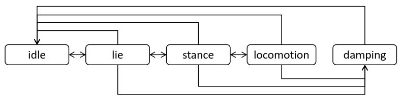

# Fire SDK

欢迎使用 **FireDog四足机器人 SDK**！本 SDK 提供了一套完整的接口，帮助开发者轻松控制和管理FireDog四足机器人，实现各种复杂的动作和行为。

## 简介

Fire SDK 是一个用于开发和控制四足机器人的软件开发工具包。它封装了底层的硬件接口，提供了易于使用的高层 API，基于TCP和UDP实现。

## 功能

- **运动控制**：实现行走、转向、爬楼梯等基础动作。
- **远程控制**：通过网络接口实现远程控制和监控。
- **传感器集成**：支持多种传感器的数据读取与处理，如摄像头、IMU、激光雷达等，待开发。
- **路径规划**：内置路径规划算法，支持自主导航，待开发。

## 系统要求

- 操作系统：Linux（推荐 Ubuntu 20.04）
- 编程语言：C++

## 构建

```bash
cd /path/to/fire_sdk
mkdir build
cd build
cmake ..
make
```

## 快速开始

运行示例代码之前，需要先启动FireDog四足机器人，并将控制模式设为外部控制。

运行示例程序：

```bash
cd build
./examples/walk_examples
```

该例子演示了如何使用 SDK 实现四足机器人站立、行走、转向等基础动作。

## 命令与状态描述

客户端需要持续发送 `HighCmd` 指令给机器人，机器人也会一直返回 `HighState` 状态给客户端。

### HighState

| 字段名称               | 类型                      | 描述                                                                                             |
|--------------------|-------------------------|------------------------------------------------------------------------------------------------|
| `state`            | `uint8_t`               | 当前状态<br> - `0`: idle<br> - `1`: lie<br> - `2`: stance<br> - `3`: locomotion<br> - `4`: damping |
| `gait`             | `uint8_t`               | 当前步态<br> - `0`: stance<br> - `1`: trot<br> - `2`: flying_trot                                  |
| `climbEnable`      | `bool`                  | 是否启用爬坡运动                                                                                       |
| `perceptiveEnable` | `bool`                  | 是否启用感知运动                                                                                       |
| `continueEnable`   | `bool`                  | 是否启用持续控制                                                                                       |
| `bodyPos`          | `std::array<float, 3>`  | 机器人在世界坐标系中的位置 (单位: 米)<br>注：来自自身的里程计，可能存在漂移                                                     |
| `bodyOri`          | `std::array<float, 4>`  | 机器人在世界坐标系中的方向 (单位: 四元数)                                                                        |
| `bodyLinVel`       | `std::array<float, 3>`  | 机器人在基坐标系中的线速度 (单位: 米/秒)                                                                        |
| `bodyAngVel`       | `std::array<float, 3>`  | 机器人在基坐标系中的角速度 (单位: 弧度/秒)                                                                       |
| `jointPos`         | `std::array<float, 12>` | 各关节的位置 (单位: 弧度)<br>顺序: LF, RF, LH, RH 每个腿的 HAA, HFE, KFE                                       |
| `jointVel`         | `std::array<float, 12>` | 各关节的速度 (单位: 弧度/秒)                                                                              |
| `jointTau`         | `std::array<float, 12>` | 各关节的扭矩 (单位: 牛米)                                                                                |
| `footForce`        | `std::array<float, 4>`  | 各足部的受力数据 (通过关节扭矩计算得到)                                                                          |
| `crc`              | `uint32_t`              | 循环冗余校验码，用于数据完整性校验                                                                              |

### HighCmd

| 字段名称               | 类型                     | 描述                                                                                                                                                                                                                                                                                                                         |
|--------------------|------------------------|----------------------------------------------------------------------------------------------------------------------------------------------------------------------------------------------------------------------------------------------------------------------------------------------------------------------------|
| `state`            | `uint8_t`              | 目标状态<br> - `0`: idle<br> - `1`: lie<br> - `2`: stance<br> - `3`: locomotion<br> - `4`: damping                                                                                                                                                                                                                             |
| `gait`             | `uint8_t`              | 目标步态<br> - `0`: stance<br> - `1`: trot<br> - `2`: flying_trot                                                                                                                                                                                                                                                              |
| `climbEnable`      | `bool`                 | 是否启用爬坡运动                                                                                                                                                                                                                                                                                                                   |
| `perceptiveEnable` | `bool`                 | 是否启用感知运动                                                                                                                                                                                                                                                                                                                   |
| `continueEnable`   | `bool`                 | 是否启用持续控制                                                                                                                                                                                                                                                                                                                   |
| `footSwingHeight`  | `float`                | 足部摆动高度 (单位: 米)<br>范围: -0.06 ~ 0.03 米<br>默认值: 0.09 米                                                                                                                                                                                                                                                                        |
| `bodyHeight`       | `float`                | 机器人身体站立高度 (单位: 米)<br>范围: -0.13 ~ 0.03 米<br>默认值: 0.31 米                                                                                                                                                                                                                                                                     |
| `pitch`            | `float`                | 机器人身体俯仰角 (单位: 弧度)<br>范围: -0.3 ~ 0.3 弧度                                                                                                                                                                                                                                                                                     |
| `bodyVel`          | `std::array<float, 3>` | 机器人速度指令：<br> - `bodyVel[0]`: x 方向线速度 (单位: 米/秒)<br> - `bodyVel[1]`: y 方向线速度 (单位: 米/秒)<br> - `bodyVel[2]`: 偏航角速度 (单位: 弧度/秒)<br> <br>**范围:**<br> - **trot 模式**: `vx` -0.8 ~ 0.8 m/s, `vy` -0.4 ~ 0.4 m/s, `vyaw` -1.5 ~ 1.5 rad/s<br> - **trot_flying 模式**: `vx` -1.6 ~ 1.6 m/s, `vy` -0.4 ~ 0.4 m/s, `vyaw` -1.5 ~ 1.5 rad/s |
| `crc`              | `uint32_t`             | 循环冗余校验码，用于数据完整性校验                                                                                                                                                                                                                                                                                                          |

## 注意事项

1. **指令发布**：客户端需要按照一定频率（100Hz以上）发送 `HighCmd` 指令给机器人，即使不更新任何指令
2. **状态切换**：状态之间的切换需要按照一定的顺序进行，机器人状态机保证了这个规则，任何违反此规则的状态切换将不生效
   
3. **安全保护**：当机器人处于“危险”情况下，请勿直接切换idle模式，应迅速切换到damping模式，切换方式可以通过sdk进行状态切换，也可直接按下遥控器上的 `C` 键